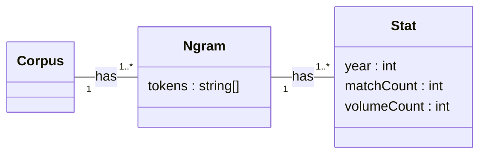
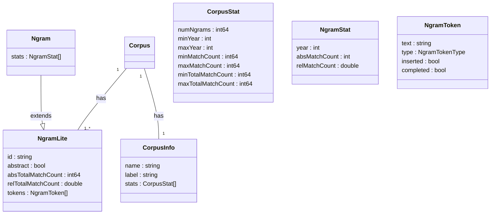

# Intro

The dataset backing NGRAMS is the [Google Books Ngram Dataset v3](https://storage.googleapis.com/books/ngrams/books/datasetsv3.html) which is the largest publicly available source of ngram data. It contains word ngrams of length 1 to 5 extracted from books digitized by Google up to and including the year 2019.

The table below gives an overview of the dataset's size.

| Corpus                          | Raw Data (compressed) |
| :------------------------------ | --------------------: |
| English                         |             13.54 TiB |
| American English :construction: |              8.23 TiB |
| British English :construction:  |              3.21 TiB |
| French                          |              3.19 TiB |
| German                          |              2.92 TiB |
| Spanish                         |              1.60 TiB |
| Italian                         |              1.42 TiB |
| Russian                         |               831 GiB |
| Hebrew                          |                92 GiB |
| Chinese (simplified)            |                78 GiB |

For comparison, the [dump of the English Wikipedia](https://dumps.wikimedia.org/enwiki/20230401/) is around 20 GiB in size.

:construction: Not indexed at the moment.

# Data Model

## Raw Data

The data model of the raw data is displayed in the diagram below. Basically each corpus is a set of ngrams. An ngram is a sequence of tokens. Each ngram has associated statistical data.

## NGRAMS

Based on the model above, NGRAMS employs a more advanced model which is displayed in the diagram below. The types are also used in our [REST API](rest-api).

### NgramLite

`raw.property` refers to a property in the raw data model.

- `NgramLite.id` is an ID generated by NGRAMS.
- `NgramLite.abstract` is a flag marking an ngram as abstract. An abstract ngram is an ngram that has been derived from other ngrams applying a filter operation such as case-folding or collapsing. An abstract ngram has no one-to-one correspondence to any ngram from the raw dataset and hence has no associated statistical data.
- `NgramLite.absTotalMatchCount` is the sum of all `Ngram.stats[i].absMatchCount` values.
- `NgramLite.relTotalMatchCount = Ngram.stats[i].absMatchCount / totalMatchCountAllYears(corpus, n)` where `totalMatchCountAllYears(corpus, n)` returns data from `total_counts` files, e.g.
  - `totalMatchCountAllYears(eng, 1)` returns data from [eng/totalcounts-1](http://storage.googleapis.com/books/ngrams/books/20200217/eng/totalcounts-1)
  - `totalMatchCountAllYears(eng, 2)` returns data from [eng/totalcounts-2](http://storage.googleapis.com/books/ngrams/books/20200217/eng/totalcounts-1)
  - and so on
- `NgramLite.tokens[i].text = raw.Ngram.tokens[i]`
- `NgramLite.tokens[i].type` is the token's type such as `TEXT` or `TAGGED_NOUN`.
- `NgramLite.tokens[i].inserted` is a flag marking the token as inserted after application of a wildcard operator. This property is dynamically computed at runtime while processing a user query.
- `NgramLite.tokens[i].completed` is a flag marking the token as completed after application of the completion operator. This property is dynamically computed at runtime while processing a user query.

### Ngram

- `Ngram.stats[i].year = raw.Stat[i].year`
- `Ngram.stats[i].absMatchCount = raw.Stat[i].matchCount`
- `Ngram.stats[i].relMatchCount = raw.Stat[i].matchCount / totalMatchCount(corpus, n, year)` where `totalMatchCount(corpus, n, year)` returns data from `total_counts` files, e.g.
  - `totalMatchCount(eng, 1, year)` returns data from [eng/totalcounts-1](http://storage.googleapis.com/books/ngrams/books/20200217/eng/totalcounts-1)
  - `totalMatchCount(eng, 2, year)` returns data from [eng/totalcounts-2](http://storage.googleapis.com/books/ngrams/books/20200217/eng/totalcounts-1)
  - and so on

### CorpusInfo

- `CorpusInfo.name` is the name of a corpus such as "English".
- `CorpusInfo.label` is the short name of a corpus such as "eng".
- `CorpusInfo.stats` is statistical data derived from the set of indexed ngrams.

### CorpusStat

- `CorpusStat.numNgrams` is the number of indexed ngrams.
- `CorpusStat.minYear` is the minimum of all `Ngram.stats[i].year` values.
- `CorpusStat.maxYear` is the maximum of all `Ngram.stats[i].year` values.
- `CorpusStat.minMatchCount` is the minimum of all `Ngram.stats[i].absMatchCount` values.
- `CorpusStat.maxMatchCount` is the maximum of all `Ngram.stats[i].absMatchCount` values.
- `CorpusStat.minTotalMatchCount` is the minimum of all `NgramLite.absTotalMatchCount` values.
- `CorpusStat.maxTotalMatchCount` is the maximum of all `NgramLite.absTotalMatchCount` values.

# Ngram Types

There are three types of ngrams in the raw dataset.

1. With text tokens only, e.g. `the quick brown fox`
2. With part-of-speech tagged tokens, e.g. `the quick brown fox_NOUN`
3. With standalone part-of-speech tags, e.g. `the quick brown _NOUN_`

Ngrams of type 2 can have multiple tagged tokens, but because of the combinatorial explosion Google did not tag 4- and 5-grams this way. So in fact, the 4-gram `the quick brown fox_NOUN` does not exist in the dataset, but the 3-gram `quick brown fox_NOUN` does.

# NGRAMS Index

NGRAMS has its own custom-made NoSQL system tailored for indexing and storing ngram data. Due to the static nature of the data, things have been heavily optimized for rapid read-only access.

The index contains ngrams of type 1 and 2, see [Ngram Types](#ngram-types), with complete statistical data as shown in [Data Model](#data-model). It does not contain ngrams of type 3 because the goal of NGRAMS' query language is to replace wildcards with actual words and not standalone tags.

The following table gives and overview of the number of ngrams that have been indexed.

| Corpus               | N   |            #Ngrams |
| :------------------- | --- | -----------------: |
| English              | 1   |         76 862 879 |
|                      | 2   |      1 604 084 580 |
|                      | 3   |     11 777 289 629 |
|                      | 4   |      5 089 891 990 |
|                      | 5   |      5 020 506 742 |
|                      |     | **23 568 635 820** |
| French               | 1   |         22 257 780 |
|                      | 2   |        373 648 990 |
|                      | 3   |      2 512 164 157 |
|                      | 4   |      1 010 122 180 |
|                      | 5   |        915 365 430 |
|                      |     |  **4 833 558 537** |
| German               | 1   |         38 799 876 |
|                      | 2   |        686 897 456 |
|                      | 3   |      2 837 000 526 |
|                      | 4   |        699 070 192 |
|                      | 5   |        409 214 917 |
|                      |     |  **4 670 982 967** |
| Spanish              | 1   |         14 105 425 |
|                      | 2   |        263 091 046 |
|                      | 3   |      1 460 173 989 |
|                      | 4   |        462 704 896 |
|                      | 5   |        332 896 021 |
|                      |     |  **2 532 971 377** |
| Italian              | 1   |         12 389 643 |
|                      | 2   |        267 440 495 |
|                      | 3   |      1 371 780 157 |
|                      | 4   |        352 961 234 |
|                      | 5   |        206 442 045 |
|                      |     |  **2 211 013 574** |
| Russian              | 1   |         12 752 587 |
|                      | 2   |        312 974 695 |
|                      | 3   |        973 936 404 |
|                      | 4   |        180 511 724 |
|                      | 5   |         97 506 251 |
|                      |     |  **1 577 681 661** |
| Chinese (simplified) | 1   |            506 451 |
|                      | 2   |         25 649 381 |
|                      | 3   |        136 654 804 |
|                      | 4   |         30 984 315 |
|                      | 5   |         17 237 379 |
|                      |     |    **211 032 330** |
| Hebrew               | 1   |          2 792 646 |
|                      | 2   |         43 757 288 |
|                      | 3   |         66 381 065 |
|                      | 4   |          7 606 178 |
|                      | 5   |          3 451 051 |
|                      |     |    **123 988 228** |
